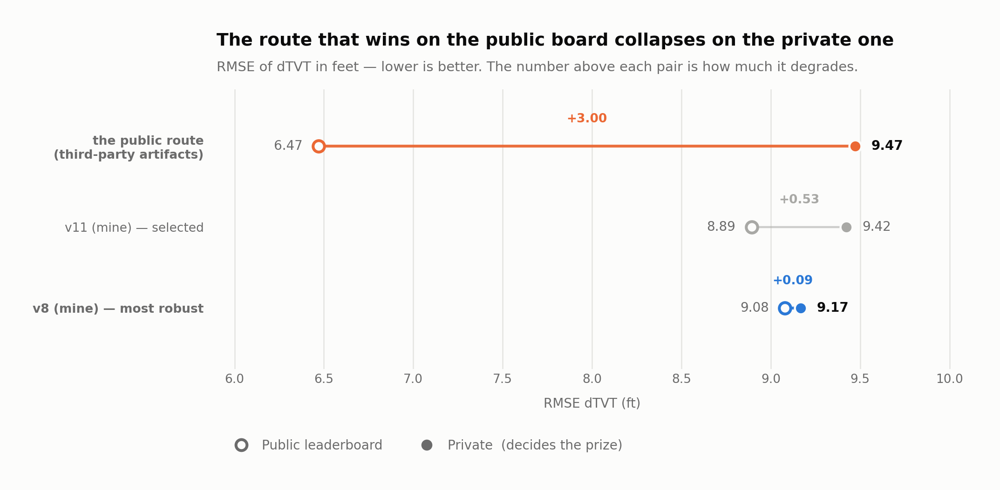

# ROGII Wellbore Geology Prediction — my own solution

Kaggle competition ([link](https://www.kaggle.com/competitions/rogii-wellbore-geology-prediction)):
predict the TVT (stratigraphic position) of horizontal wells beyond the PS point, from the
trajectory (MD, X, Y, Z), the well's gamma-ray log and a vertical reference *typewell*.
Metric: RMSE of dTVT in feet. It is a code competition: you submit a notebook that Kaggle
re-runs against a hidden test set.

## Result

**1,075th of 6,125 (top 17.6%)** on the
[private leaderboard](https://www.kaggle.com/competitions/rogii-wellbore-geology-prediction/leaderboard),
climbing 2,299 places from the public one (I started at 3,381). Solo entry, no team. Figure
read from [kaggle.com/marcmaldonado](https://www.kaggle.com/marcmaldonado/competitions) on
2026-09-06; at the close of the competition it was 1,082 of 6,191, and the difference is
teams withdrawn afterwards.



| submission | public | **private** | degradation |
| --- | --- | --- | --- |
| the public route (third-party artifacts — the one that brushes a medal on the public board) | 6.470 | **9.471** | +3.00 |
| v11 (my own, recalibrated σ_GR) — the selected one | 8.893 | **9.422** | +0.53 |
| v8 (my own, 2D adaptive blend) — the most robust | 9.079 | **9.167** | **+0.09** |

The project's thesis was demonstrated with data: the shared-artifact pipeline that dominates
the public board collapses by 3 points on the private one and ends up below every model of my
own. The simplest one (v8, no GBM) was also the most stable — it degraded by only +0.09,
while adding more machinery made degradation worse.

## The finding that structures the solution

Measured over the 773 training wells, with a residual of **0.0065 ft** (the data's own
rounding) across 100% of the wells and for all 6 formations:

```
TVT_i = S_k(X_i, Y_i) − Z_i + C_well,k
```

This is not a time-series problem: **TVT is the height of a geological surface evaluated along
the trajectory**, plus a per-well constant. There are only two unknowns: the surface `S`
(global, learnable from the training wells) and `C_well` (calibratable from the pre-PS prefix,
which is known at test time).

## Architecture

1. **Anisotropic geological surface** — an (X, Y, BUDA) cloud from the 773 wells, IDW over a
   metric rotated to the principal direction of the trajectories and stretched (`aniso=16`,
   `theta=2.278489`). The wells are nearly parallel lines: without anisotropy the *k* nearest
   neighbours all come from the same adjacent well instead of giving a cross-section. This
   change alone took the surface from 24.2 to 12.9 ft.
2. **Multi-seed particle filter** over the stratigraphic level `U = TVT + Z`, following the
   gamma-ray against the typewell (64 seeds, simple mean).
3. **2D inverse-variance fusion** — each signal's weight is decided *per point*:
   `w_s = σ_p² / (σ_s² + σ_p²)`, with `σ_s(nn_dist, md_since)` in a 2D table and
   `σ_p(md_since)`. The surface rules where neighbouring wells are close; the particle filter
   rules far from PS and in isolated areas.
4. **Final layers** — robust IRLS projection, a continuity ramp at PS, and a contact override
   with a double guard (it can never make things worse).

## What was measured and did not work

Documented with numbers in [`DECISIONS.md`](DECISIONS.md). The essentials: **the pre-PS prefix
does not predict post-PS behaviour**. It failed three times by different routes — per-well
offset (corr −0.05), per-well weights (below threshold, CI crosses zero) and hard selection by
backtest. Also dropped: global GR matching (the gamma-ray tracks but does not localise — 1σ of
noise is worth 8.3 ft of TVT), Markowitz-style covariance, and model blending, both of which
flipped sign between validation subsets.

## Limitations and next steps

- The model selected for the final submission (v11) was not the most robust one as measured on
  private (v8 was); Kaggle auto-selects by public score, not by local CV, and that mismatch is
  the central lesson of the project.
- The per-well offset still cannot be captured from the pre-PS prefix with the features tried
  (LightGBM captures ~3% of the variance and does not transfer) — it is the route with the most
  headroom if this is picked up again.
- No data from other fields: the anisotropic surface is fitted to the 773 wells of this dataset
  and its transfer to different geology has not been tested.

## Reproducing

```bash
uv venv --python 3.12 .venv
uv pip install --python .venv/bin/python pandas numpy scipy scikit-learn lightgbm numba
kaggle competitions download -c rogii-wellbore-geology-prediction -p data && unzip -d data/raw data/*.zip
.venv/bin/python cv.py            # geometric baseline on the harness
.venv/bin/python model.py 150     # surface + HMM
```

`cv.py` is the validation harness: it replicates the test format exactly (only
`MD, X, Y, Z, GR, TVT_input` + typewell) with strict leave-one-well-out on everything spatial,
and exposes `rmse_lb_proxy`, which anticipated the leaderboard to within 0.8%.

The final self-contained submission is [`kernel/rogii_v11.py`](kernel/rogii_v11.py): a single
file, with no external datasets and no third-party models.
