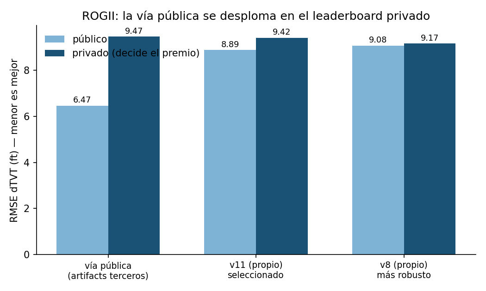

# ROGII Wellbore Geology Prediction — solución propia

Competición Kaggle ([enlace](https://www.kaggle.com/competitions/rogii-wellbore-geology-prediction)):
predecir el TVT (posición estratigráfica) de pozos horizontales más allá del punto
PS, a partir de la trayectoria (MD, X, Y, Z), el gamma-ray del pozo y un *typewell*
vertical de referencia. Métrica: RMSE de dTVT en pies. Es *code competition*: se
envía un notebook que Kaggle re-ejecuta contra un test oculto.

## Resultado

**Puesto 1.082 de 6.191 (top 17%)** en el leaderboard privado, subiendo 2.299
puestos respecto al público (veníamos del 3.381) — el mayor shakeup de la
competición en nuestro rango.



| envío | público | **privado** | degradación |
| --- | --- | --- | --- |
| vía pública (artifacts de terceros, la que roza la medalla en el escaparate) | 6,470 | **9,471** | +3,00 |
| v11 (propio, σ_GR recalibrado) — el seleccionado | 8,893 | **9,422** | +0,53 |
| v8 (propio, blend adaptativo 2D) — el más robusto | 9,079 | **9,167** | **+0,09** |

La tesis del proyecto quedó demostrada con datos: el pipeline de artifacts
compartidos que domina el escaparate público se desploma 3 puntos en el privado
y termina por debajo de todos nuestros modelos propios. El más simple (v8, sin
GBM) fue también el más estable — degradó solo +0,09 mientras que añadir más
maquinaria empeoraba la degradación.

## El hallazgo que estructura la solución

Medido sobre los 773 pozos de train, con residuo de **0,0065 ft** (el propio
redondeo de los datos) en el 100% de los pozos y para las 6 formaciones:

```
TVT_i = S_k(X_i, Y_i) − Z_i + C_well,k
```

No es un problema de series temporales: **TVT es la altura de una superficie
geológica evaluada sobre la trayectoria**, más una constante por pozo. Solo hay
dos incógnitas: la superficie `S` (global, aprendible de los pozos de train) y
`C_well` (calibrable con el prefijo pre-PS, que en test sí se conoce).

## Arquitectura

1. **Superficie geológica anisótropa** — nube (X, Y, BUDA) de los 773 pozos, IDW
   sobre una métrica rotada a la dirección principal de las trayectorias y
   estirada (`aniso=16`, `theta=2.278489`). Los pozos son líneas casi paralelas:
   sin anisotropía los *k* vecinos salen del mismo pozo vecino en vez de dar
   sección transversal. Este cambio solo llevó la superficie de 24,2 a 12,9 ft.
2. **Particle filter multi-semilla** sobre el nivel estratigráfico `U = TVT + Z`,
   siguiendo el gamma-ray contra el typewell (64 semillas, media simple).
3. **Fusión por varianza inversa 2D** — el peso de cada señal se decide *por
   punto*: `w_s = σ_p² / (σ_s² + σ_p²)`, con `σ_s(nn_dist, md_since)` en tabla 2D
   y `σ_p(md_since)`. La superficie manda donde hay pozos vecinos cerca; el PF
   manda lejos del PS y en zonas aisladas.
4. **Capas finales** — proyección robusta IRLS, rampa de continuidad en PS y
   *contact override* con doble guarda (nunca empeora).

## Qué se midió y no funcionó

Documentado en [`DECISIONS.md`](DECISIONS.md) con números. Lo esencial: **el
prefijo pre-PS no predice el comportamiento post-PS**. Falló tres veces por vías
distintas — offset por pozo (corr −0,05), pesos por pozo (bajo umbral, IC cruza
cero) y selección dura por backtest —. También cayeron el matching global por GR
(el gamma-ray rastrea pero no localiza: 1σ de ruido equivale a 8,3 ft de TVT), la
covarianza tipo Markowitz y la mezcla de modelos, ambas por invertir el signo
entre subconjuntos de validación.

## Limitaciones y siguientes pasos

- El modelo seleccionado para el envío final (v11) no era el más robusto medido
  en privado (v8 lo era); Kaggle auto-selecciona por score público, no por CV
  local, y ese desajuste es la lección central del proyecto.
- El offset por pozo sigue sin ser capturable desde el prefijo pre-PS con las
  features probadas (LightGBM captura ~3% de la varianza y no transfiere) — es
  la vía con más recorrido si se retoma.
- Sin datos de otros campos: la superficie anisótropa se ajusta a los 773 pozos
  de este dataset y no se ha probado su transferencia a geología distinta.

## Reproducir

```bash
uv venv --python 3.12 .venv
uv pip install --python .venv/bin/python pandas numpy scipy scikit-learn lightgbm numba
kaggle competitions download -c rogii-wellbore-geology-prediction -p data && unzip -d data/raw data/*.zip
.venv/bin/python cv.py            # baseline geométrico sobre el harness
.venv/bin/python model.py 150     # superficie + HMM
```

`cv.py` es el harness de validación: replica exactamente el formato del test
(solo `MD, X, Y, Z, GR, TVT_input` + typewell) con *leave-one-well-out* estricto
en todo lo espacial, y expone `rmse_lb_proxy`, que anticipó el leaderboard con
0,8% de error.

El envío final autocontenido es [`kernel/rogii_v11.py`](kernel/rogii_v11.py): un
único fichero, sin datasets externos ni modelos ajenos.
